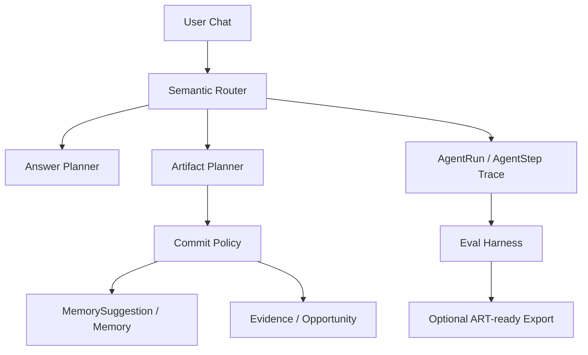

# Career Memory Agent

A memory-first, evidence-grounded, evaluation-driven Career Agent with auditable
agent traces, user-confirmed memory, reward-driven evals, and an optional ART-ready
trajectory export bridge.

[]()
[]()
[]()
[]()
[](https://github.com/QingyangJiang/career-memory-agent-public/actions/workflows/ci.yml)
[]()

## 30-second Summary

Career Memory Agent is a Reliable Agent portfolio project. It is not a resume
generator, auto-apply bot, job board, or production SaaS. The core problem is harder:
preserving career context over many turns while avoiding unsafe memory writes,
weak-evidence object creation, and untraceable side effects.

All public demo data uses a synthetic persona. The repo does not contain a real
candidate's employer, compensation, projects, or interview history.

The ART bridge is an optional eval-to-RL data interface. It is not an ART training
run, does not add ART as a production dependency, and does not claim model-quality
improvement.

## Live Demo

Online demo: [https://career-opportunity-agent-demo.onrender.com/demo](https://career-opportunity-agent-demo.onrender.com/demo)

The public demo defaults to the Mock provider and focuses on workflow, safety, trace,
and evaluation evidence. On Render free-tier deployments it may cold start. The
Render service URL may retain the old service name, but all GitHub artifact links
point to this sanitized public repo.

## Why This Project Matters

Reliable agents need more than fluent answers. A career agent must know when to keep
context ephemeral, when to propose durable memory, when evidence is sufficient for
structured artifacts, and how to leave a trace that can be evaluated later.

This repo turns those requirements into a concrete loop:

```text
Reliable Agent Eval -> Failure Taxonomy -> Source-object Grounding
-> Reward Design -> ART-ready Trajectory Export -> Demo-safe Online Review
```

## What This Project Demonstrates

- User-confirmed long-term memory via `MemorySuggestion`, not silent profile mutation.
- Evidence-before-conclusion opportunity analysis from raw JD, recruiter, interview,
  and project material.
- Object-creation guardrails for weak JD snippets and follow-up turns.
- Persisted `AgentRun` / `AgentStep` traces for audit and debugging.
- Reward-driven eval harness with rule/model/hybrid scorers, hard assertions, soft
  scores, and failure taxonomy.
- Source-object grounding pilot for memory/evidence citation checks.
- Optional ART-ready JSONL export with a clearly marked non-training reward heuristic.

## Latest Evaluation Snapshot

Latest public report:
[evals/career-agent/reports/latest.md](evals/career-agent/reports/latest.md)

Machine-readable manifest:
[evals/career-agent/reports/latest.manifest.json](evals/career-agent/reports/latest.manifest.json)

The snapshot records actual local runs only. It is not a full benchmark.

| Run | Provider/model | Cases | Result | Main signal |
|---|---|---:|---|---|
| Mock smoke | `mock/MockLLMProvider` | 3 | 3/3 PASS | Local smoke path and memory/object safety checks passed. |
| Mock core-safety | `mock/MockLLMProvider` | 5 | 4/5 PASS | Exposes known external-source router policy mismatch. |
| DeepSeek follow-up suite | `deepseek/deepseek-v4-flash` | 1 | 1/1 PASS | Context follow-up passed after accepting `ask_for_next_steps` as a valid subtype. |
| DeepSeek opportunity-light suite | `deepseek/deepseek-v4-flash` | 3 | 3/3 PASS | Short/staged JD behavior checks passed. |
| DeepSeek memory suite | `deepseek/deepseek-v4-flash` | 4 | 3/4 PASS | Source-object fixture passed; legacy string citation still mismatches. |
| Diagnostic DeepSeek 3-case run | `deepseek/deepseek-v4-flash` | 3 | 0/3 PASS | Preserved diagnostic failures: action-level mismatch, citation mismatch, timeout. |

Known failures are intentionally preserved in the report because they show what the
eval harness catches.

## Architecture At A Glance



The system keeps conversation, durable memory, raw evidence, derived opportunity
objects, and trace data separate. See [docs/architecture.md](docs/architecture.md)
for the full architecture overview.

## Quick Start

```bash
npm install
npx prisma migrate dev
npm run seed
npm run dev
```

Open `http://localhost:3000`. The local MVP works without an API key through
`MockLLMProvider`.

Minimal reviewer verification:

```bash
npm run typecheck
npm run build
npm run art:export -- --example
npm run eval:career-agent -- --provider=mock-smoke --suite=ci-smoke
npm run eval:coverage
npm run public:hygiene
npm run public:links
```

`ci-smoke` is a stable local regression path, not a full benchmark. GitHub Actions
prepares a local SQLite schema, seeds synthetic demo data, and runs mock-only checks.
CI does not require DeepSeek credentials or any real provider.

## Documentation Guide

Start with the canonical documentation index:
[docs/README.md](docs/README.md)

Most reviewers only need:

- [Reviewer guide](docs/reviewer-guide.md): 3-minute and 10-minute review paths.
- [Status matrix](docs/status-matrix.md): implemented, partial, planned, and not
  measured scope.
- [Reward / scorer design](docs/reward-scorer-design.md): reward dimensions,
  rule/model/hybrid scorer split, hard-gate caps, and LLM-judge boundary.
- [Case coverage matrix](evals/career-agent/case-coverage.md): reward dimension to
  case coverage, CI/offline/RL curriculum mapping, and deprecated/demo case status.
- [Architecture overview](docs/architecture.md): core objects and request lifecycle.
- [Evaluation report](evals/career-agent/reports/latest.md): current public snapshot.
- [Privacy sanitization](docs/privacy-sanitization.md): synthetic persona boundary.

## Known Boundaries

- Public demo defaults to Mock provider; real-provider quality is not the demo claim.
- DeepSeek results are partial suite runs, not a full model benchmark.
- MiMo and OpenAI-compatible provider results are not measured.
- SQLite is local-first; hosted multi-user production hardening is not implemented.
- External JD search is not implemented; users paste source material.
- Streaming and tool calling are not implemented yet.
- Demo reset endpoint is a protected placeholder, not an automatic data reset system.
- ART training is not implemented; there is no trained model id or before/after eval.
