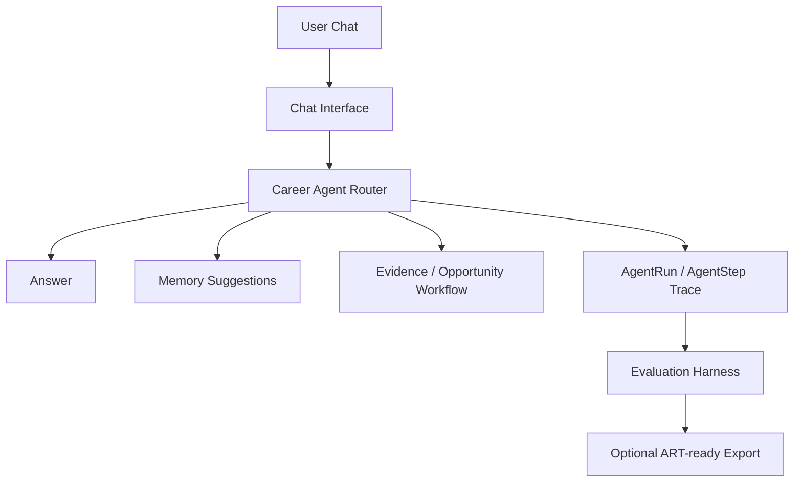

# Career Memory Agent

A memory-first, evidence-grounded, evaluation-driven Career Agent with auditable agent
traces, user-confirmed memory, case-driven evals, and an optional ART-ready trajectory
export bridge.

[]()
[]()
[]()
[]()
[](https://github.com/QingyangJiang/career-opportunity-agent/actions/workflows/ci.yml)
[]()

## 30-second Summary

Career Memory Agent is a portfolio project for reliable LLM agents. It is not a resume
generator, auto-apply bot, or job board. The core problem is harder: preserving career
context over many turns while avoiding unsafe memory writes, weak-evidence object
creation, and untraceable side effects.

The project demonstrates:

- user-confirmed long-term memory instead of silent profile mutation;
- evidence-before-conclusion opportunity analysis;
- persisted `AgentRun` / `AgentStep` traces for audit and debugging;
- provider-based LLM routing across Mock and DeepSeek paths;
- deterministic hard assertions, soft scores, and failure taxonomy;
- an optional eval-to-RL export bridge for future Agent RL research.

## Latest Eval Snapshot

Latest public eval results are summarized in
[evals/career-agent/reports/latest.md](evals/career-agent/reports/latest.md). The
report records actual local runs only; it is not a full benchmark.

| Eval run | Result | Evidence |
|---|---|---|
| Mock smoke | 3/3 PASS | 100.0% hard assertion pass rate |
| Mock `core-safety` suite | 4/5 PASS | Exposes Mock evidence-sufficiency mismatch on external-source request |
| Targeted DeepSeek `weak_jd_should_not_create_objects` | PASS | Weak JD did not over-create objects on rerun |
| Targeted DeepSeek `follow_up_uses_context` | PASS | Follow-up context case passed |
| DeepSeek `follow-up` suite | 1/1 PASS | 2026-05-10 rerun passed after accepting `ask_for_next_steps` as a valid subtype |
| DeepSeek `opportunity-light` suite | 3/3 PASS | Short/staged JD behavior checks passed |
| DeepSeek `memory` suite | 3/4 PASS | Source-object compensation memory fixture passed; legacy string citation still mismatches |
| Diagnostic DeepSeek 3-case run | 0/3 PASS | Exposes action-level mismatch, citation mismatch, and complete JD timeout |

Known failures are preserved because they are useful reliability evidence:

- `needs_external_source`: Mock router policy mismatch on evidence sufficiency.
- `compare_opportunities`: DeepSeek action-level mismatch.
- `compensation_question_uses_memory_without_dump`: legacy string citation mismatch.
- `complete_jd_can_create_objects`: 60s timeout diagnostic.

## What This Project Demonstrates

- **Reliable Agent Eval:** hard assertions protect memory safety, evidence precision,
  follow-up behavior, provider expectations, and trace completeness.
- **Failure Taxonomy:** failures are grouped into engineering categories such as
  memory pollution, over-automation, citation mismatch, router policy mismatch, and
  runtime timeout.
- **Evidence-grounded Workflow:** raw JD, recruiter, interview, and project content is
  treated as evidence before derived Opportunity, Risk, OpenQuestion, or Decision
  objects.
- **Memory Safety:** long-term `Memory` requires a pending `MemorySuggestion` plus user
  confirmation.
- **Traceability:** meaningful work creates `AgentRun` / `AgentStep` records so eval
  failures can be debugged.
- **Feedback-loop Readiness:** eval reports, failure taxonomy, reward design, and
  trajectory export form a path from reliable evals to future RL experiments.

## ART-ready Agent RL Bridge

The repository includes an optional research bridge for OpenPipe ART / Agent
Reinforcement Trainer. It maps eval reports and agent traces into trajectory-shaped
JSONL artifacts for future Agent RL / GRPO experiments.

Current status:

- no ART production dependency;
- no GPU, vLLM, ART server, or training environment requirement;
- no ART training run;
- no trained model id;
- no before/after ART eval;
- no model-quality improvement claim.

Dry-run schema inspection:

```bash
npm run art:export -- --example
```

Example local export from a generated eval report:

```bash
npm run eval:career-agent -- --provider=mock-smoke --suite=core-safety
npm run art:export -- --input evals/career-agent/report.json --output evals/career-agent/art/trajectories/core-safety.jsonl
```

`evals/career-agent/report.json` and `evals/career-agent/report.md` are local generated
files and are ignored by Git. The committed weak-JD trajectory fixture is example-only,
not a training dataset.

## Online Demo

Online demo: [https://career-opportunity-agent-demo.onrender.com/demo](https://career-opportunity-agent-demo.onrender.com/demo)

The demo mode is intended for portfolio review, not production SaaS. It shows seeded
career data, memory-safety behavior, weak-JD guardrails, opportunity-light object
creation, AgentRun traces, eval reports, and the example-only ART-ready export fixture.
Demo scenario cards open a prefilled chat through `/chat?prefill=...`.
On Render free-tier deployments, the public demo may cold start.

Demo boundaries:

- Mock provider by default; the public demo focuses on workflow and safety evidence.
- DeepSeek is disabled unless explicitly enabled for a controlled deployment.
- Do not enter private personal information.
- Demo data may reset on redeploy or service restart.
- Eval and ART artifacts are linked as public evidence, not training results.
- Demo launch and manual QA checklists live in
  [docs/deployment-demo.md](docs/deployment-demo.md).

## Documentation Map

- [Evaluation design](docs/evaluation-design.md): hard assertions, soft scoring,
  failure taxonomy, citation grounding direction, and opportunity suite design.
- [Latest evaluation report](evals/career-agent/reports/latest.md): structured public
  report with summary, known failures, unmeasured metrics, and next suites.
- [Evaluation report index](evals/career-agent/reports/README.md): how generated local
  reports relate to committed public snapshots.
- [Latest report manifest](evals/career-agent/reports/latest.manifest.json):
  machine-readable metadata for the committed public snapshot.
- [ART integration bridge](docs/art-integration.md): trajectory schema, export phases,
  and non-goals.
- [ART reward design](evals/career-agent/art/reward-design.md): proposed
  component-level reward design versus the current exporter heuristic.
- [ART export validation](evals/career-agent/art/export-validation.md): commands and
  required JSONL fields for reviewer verification.
- [Demo deployment guide](docs/deployment-demo.md): demo-safe environment variables,
  SQLite deployment route, reset boundary, and future Vercel/Postgres route.
- [Privacy sanitization](docs/privacy-sanitization.md): synthetic persona, demo seed
  boundary, sanitized eval reports, and Git history caveat.
- [Product architecture](docs/product-architecture.md): product surfaces, data model,
  provider boundary, and workflow overview.
- [Router design](docs/router-design.md): semantic router, planner split, guardrails,
  and action levels.
- [Memory model](docs/memory-model.md): conversation context, working memory, durable
  memory, and memory suggestion policy.
- [UI and trace](docs/ui-and-trace.md): markdown rendering, status UI, pending action
  counts, Agent Summary, and trace surfaces.
- [InspectAI adapter notes](evals/career-agent/inspect/README.md): dataset / solver /
  scorer adapter around the existing eval oracle.

## Quick Start / Verification

Install dependencies, prepare SQLite, and start the local app:

```bash
npm install
npx prisma migrate dev
npm run seed
npm run dev
```

Open `http://localhost:3000`. The local MVP works without an API key through
`MockLLMProvider`.

Core verification:

```bash
npm run typecheck
npm run build
npm run eval:career-agent -- --provider=mock-smoke --suite=core-safety
```

Minimal reviewer path:

```bash
npm run typecheck
npm run build
npm run art:export -- --example
npm run eval:career-agent -- --provider=mock-smoke --suite=ci-smoke
```

`ci-smoke` is a stable local regression path for CI and reviewer checks. It is not a
full benchmark and does not replace the broader eval suites.
GitHub Actions prepares a local SQLite schema with `prisma db push` and seeded demo
data before running this mock-only eval path; CI does not require a DeepSeek key or any
real provider.

Additional eval commands:

```bash
npm run eval:career-agent -- --provider=deepseek-flash --suite=follow-up
npm run eval:career-agent -- --provider=deepseek-flash --suite=memory
npm run eval:career-agent -- --provider=deepseek-flash --suite=opportunity
```

Supported opportunity split:

```bash
npm run eval:career-agent -- --provider=deepseek-flash --suite=opportunity-light
npm run eval:career-agent -- --provider=deepseek-flash --suite=opportunity-heavy
```

The split keeps lightweight behavior checks separate from long-JD latency and timeout
diagnostics. These suites are available, but their DeepSeek results are not part of the
committed public snapshot unless explicitly reported.

## Architecture Overview

Career Memory Agent is organized around five layers:

1. **Chat Interface**

   Natural career conversations remain the primary interaction surface.

2. **Memory Layer**

   Durable facts, preferences, goals, and constraints are saved only after user
   confirmation.

3. **Evidence Layer**

   Raw JD, recruiter, interview, and project materials are stored separately from
   generated conclusions.

4. **Opportunity Layer**

   Sufficient evidence can create structured opportunities, assessments, risks, open
   questions, and decisions.

5. **Agent Run & Evaluation Layer**

   Agent actions, provider metadata, created objects, eval signals, and failure
   categories remain inspectable.



## Key Capabilities

- Chat-first career workflow with structured artifacts as enhancement layers.
- User-confirmed long-term memory via `MemorySuggestion`.
- Evidence-grounded opportunity analysis from sufficient source material.
- Follow-up resolution using recent thread context and previous assistant content.
- Provider boundary for Mock, DeepSeek, and planned OpenAI-compatible / MiMo paths.
- Case-driven evaluation with hard assertions, soft scores, and failure taxonomy.
- JSONL trajectory export for optional future Agent RL research.

## Roadmap / Known Limitations

Implemented:

- Chat-first career agent UI.
- SQLite + Prisma local data model.
- Memory suggestion workflow.
- Evidence and opportunity management.
- Agent run trace view.
- Case-driven evaluation harness.
- ART-ready trajectory export bridge.
- Stable `ci-smoke` regression suite.
- Opportunity-light / opportunity-heavy suite split.
- Initial source-object grounding assertion pilot.

Planned:

- DeepSeek provider refinement.
- Xiaomi MiMo provider.
- OpenAI-compatible provider interface.
- Provider metadata comparison.
- Broader stable memory-id fixture coverage beyond the current compensation pilot.

Known limitations:

- The MVP is local-first and uses SQLite rather than a hosted multi-user database.
- External JD search is not implemented; users paste JD, recruiter, or interview text.
- Streaming and tool calling are not implemented yet.
- Cost, aggregate JSON validity, MiMo results, OpenAI-compatible provider results, and
  ART training results are not measured.
