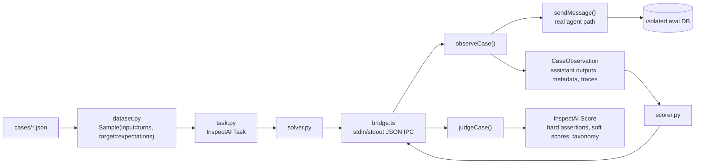

# Career Agent InspectAI Adapter

This directory adds an InspectAI-compatible runtime around the existing career-agent eval core. It is an adapter, not a replacement.



## What Stays Domain-specific

The behavioral oracle remains in TypeScript:

- `evals/career-agent/cases/*.json` keep the existing schema.
- `observeCase()` still calls the real `sendMessage()` execution path.
- `judgeCase()` still owns hard assertions, soft scoring, error taxonomy, and suggested fixes.
- DB isolation still copies `prisma/dev.db` into `evals/career-agent/history/eval-*.db`.
- `npm run eval:career-agent` remains the legacy CI/report runner and still writes `report.md` / `report.json`.

InspectAI provides a standardized dataset / solver / scorer shell plus interactive logs.

## Commands

Install InspectAI in the Python environment used by the shell:

```bash
pip install inspect-ai
```

Run a local mock InspectAI eval:

```bash
npm run inspect:eval
```

Open Inspect logs:

```bash
npm run inspect:view
```

Run the adapter smoke test without requiring InspectAI:

```bash
npm run inspect:smoke
```

Run a single real-provider case after configuring `DEEPSEEK_API_KEY`:

```bash
python3 -m inspect_ai eval evals/career-agent/inspect/task.py@career_agent \
  --model mockllm/model \
  --log-dir evals/career-agent/inspect/logs \
  -T provider=mock-smoke
```

If InspectAI cannot write to its default application-support trace directory, keep traces in the workspace:

```bash
INSPECT_TRACE_FILE=evals/career-agent/inspect/logs/trace.log \
python3 -m inspect_ai eval evals/career-agent/inspect/task.py@career_agent \
  --model mockllm/model \
  --log-dir evals/career-agent/inspect/logs \
  -T provider=deepseek-flash \
  -T case=weak_jd_should_not_create_objects
```

## Inspect Log Shape

Each Inspect sample shows:

- input: JSON-stringified `turns`;
- target: JSON-stringified `expectations`;
- metadata: `id`, `title`, `provider`, `tags`, `case_path`;
- solver output: concatenated assistant outputs from the real agent;
- score metadata: hard pass/fail, hard assertions, soft score breakdown, taxonomy, suggested fixes, created objects, action level, intent, evidence sufficiency, latency, token usage, AgentRun IDs, and AgentStep counts.

Example score metadata:

```json
{
  "hardPassFail": true,
  "hardPassRate": 1,
  "softScoreBreakdown": {
    "answerRelevance": 4.5,
    "memorySafety": 5,
    "traceCompleteness": 5
  },
  "taxonomy": [],
  "createdObjects": [{ "memorySuggestionsCount": 0 }],
  "actionLevel": "answer_only",
  "intent": "ask_question",
  "evidenceSufficiency": "none",
  "agentRunIds": ["..."],
  "agentStepCounts": [3]
}
```

## Migration Notes

This is phase one of the standardization:

- Added `dataset.py` to project existing JSON cases into InspectAI `Sample`s.
- Added `solver.py` to invoke the TypeScript bridge and preserve the real agent execution path.
- Added `scorer.py` to call `judgeCase()` and convert the result to an InspectAI `Score`.
- Added `bridge.ts` for lightweight JSON IPC via `tsx`, stdin, and stdout.
- Exported `observeCase()`, `prepareEvalDb()`, and related types from the legacy runner so both runtimes share implementation.
- Preserved the legacy runner as the markdown/json report generator and CI regression entrypoint.

Phase two interfaces are reserved in `bridge.ts` for repeat/flaky evaluation, reward breakdowns, trajectory export, RL reward mapping, multi-provider comparison, LLM judge, and DB diff oracle. They are intentionally not implemented yet.
